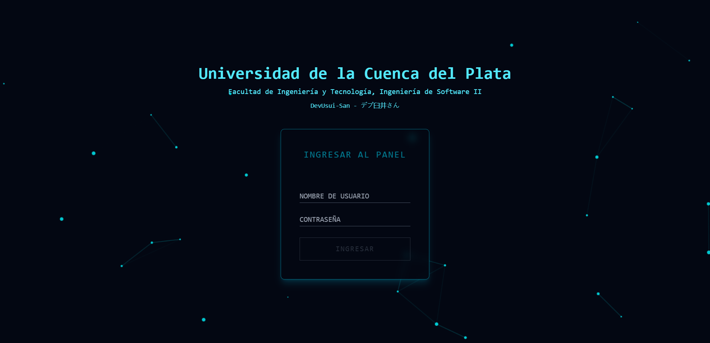
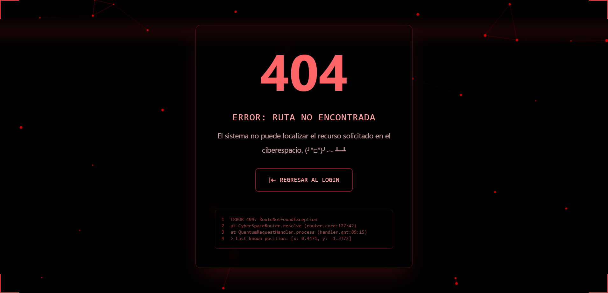
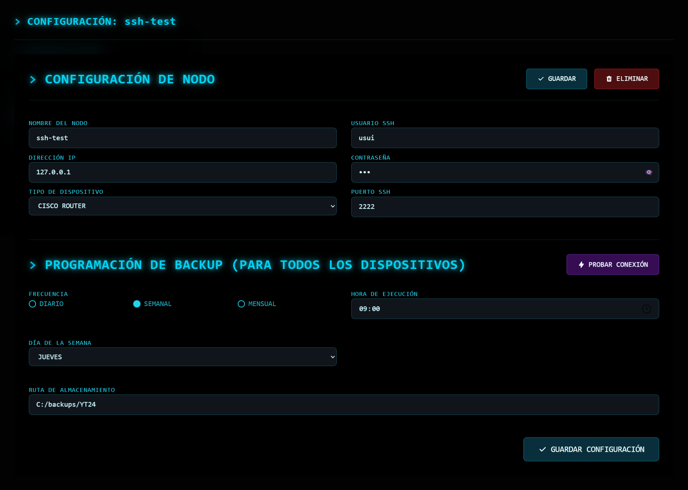
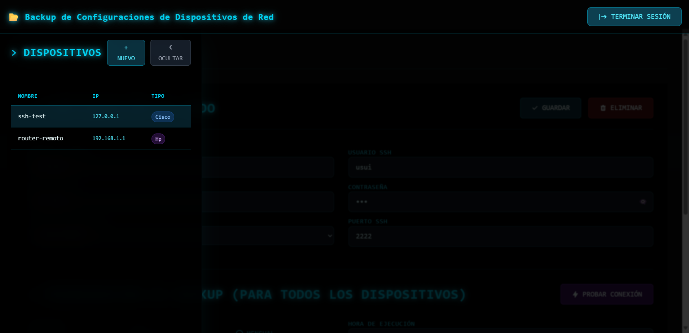

# 📦 Docker Backup Manager (Frontend)

Una aplicación Angular diseñada para gestionar y automatizar **backups de configuraciones almacenadas en contenedores Docker**, mediante autenticación, pruebas SSH y una interfaz moderna.

---

## 🎓 Proyecto Académico

- **Asignatura:** Ingeniería de Software II  
- **Carrera:** Ingeniería en Sistemas de Información  
- **Docente Responsable:** Ing. René Gabriel Kutz  
- **Institución:** Universidad de la Cuenca del Plata  
- **Facultad:** Facultad de Ingeniería y Tecnología  

---

## 🚀 Características

- 🔐 **Autenticación segura con JWT**
- 🛠 **Pruebas de conexión SSH a dispositivos remotos**
- 💾 **Respaldo automatizado de rutas como `/etc`, `/home` y `/var`**
- 📋 **Panel de administración para visualizar dispositivos y configurar backups**
- ⚠️ **Manejo centralizado de errores**
- 🌐 **Interfaz conectada a un backend RESTful**

## 🧩 Estructura del Proyecto

```
src/
 ┣ app/
 ┃ ┣ login/              → Pantalla de autenticación
 ┃ ┣ panel/              → Dashboard para configuración y ejecución de backups
 ┃ ┣ error/              → Componente visual de manejo de errores
 ┃ ┣ shared/
 ┃ ┃ ┣ models/           → Interfaces de datos: BackupConfig, Device, SSH Response
 ┃ ┃ ┣ services/         → Servicios como AuthService
 ┃ ┃ ┣ guards/           → Rutas protegidas con AuthGuard
 ┃ ┃ ┗ interceptors/     → Interceptores HTTP (JWT)
 ┣ environments/         → Configuración para desarrollo y producción
 ┣ index.html            → Entrada principal de la app
 ┣ main.ts               → Bootstrap Angular
 ┗ styles.scss           → Estilos globales
```

---

## ⚙️ Configuración del entorno

1. Clona el repositorio:
   ```bash
   git clone https://github.com/devusuix/docker-backup-ui.git
   cd docker-backup-ui
   ```

2. Instala las dependencias:
   ```bash
   npm install
   ```

3. Configura tu endpoint del backend en `environment.ts`:
   ```ts
   export const environment = {
     production: false,
     apiUrl: 'http://localhost:8080/api'
   };
   ```

4. Ejecuta la aplicación:
   ```bash
   ng serve --open
   ```

---

## 🔄 Integración con Backend

Esta aplicación se conecta con un backend Spring Boot que:
- Orquesta comandos SSH remotos
- Expone endpoints REST como `/api/panel`, `/api/devices`, `/api/auth/login`
- Realiza respaldos de configuraciones almacenadas en contenedores y los guarda en una carpeta local.

---

## 📸 Vista previa

### Login Page



### Error Page



### Dashboard Page



#### Device



---

## 🛠 Tecnologías Usadas

- [Angular 20](https://angular.io/)
- TypeScript, RxJS
- SCSS, HTML5
- Docker (como objetivo de respaldo)

---

## 👤 Autor

Desarrollado por **DevUsui-San**  
_“Respalda con estilo, automatiza con propósito.”_

---

## 📝 Licencia

Este proyecto es de código abierto y puedes adaptarlo libremente según tus necesidades.
